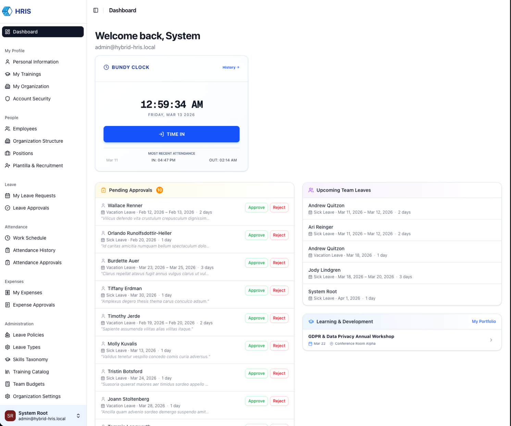
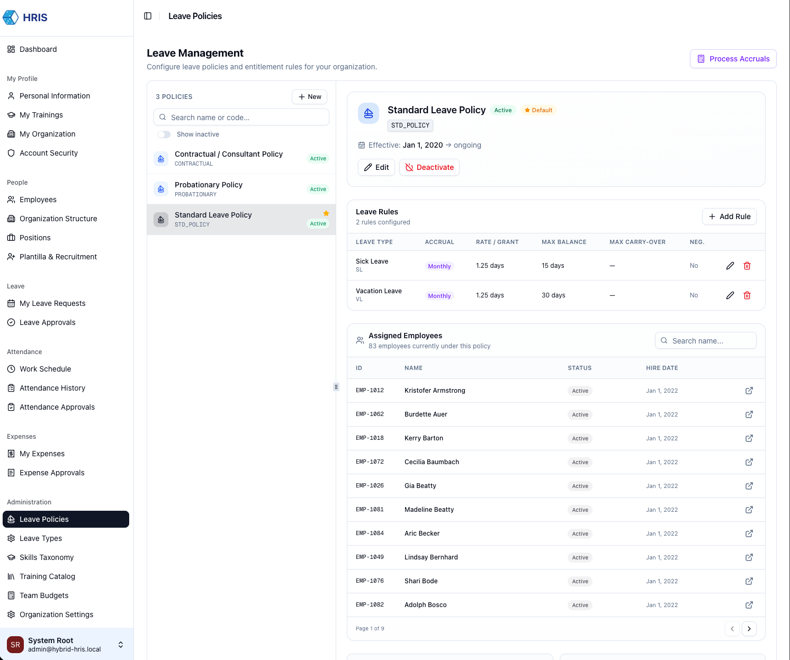
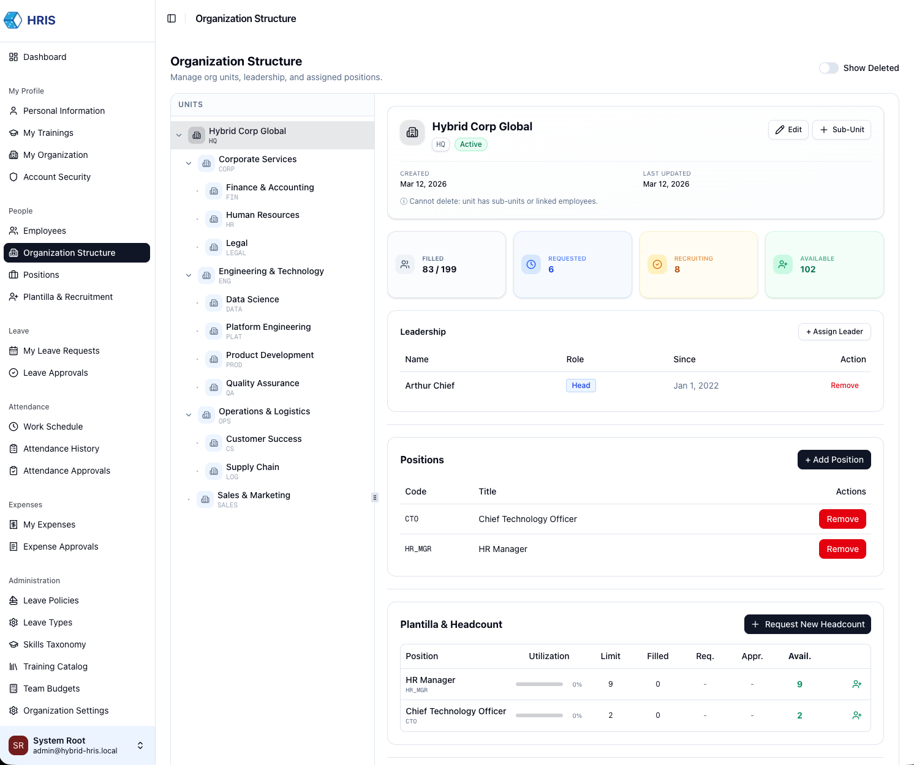
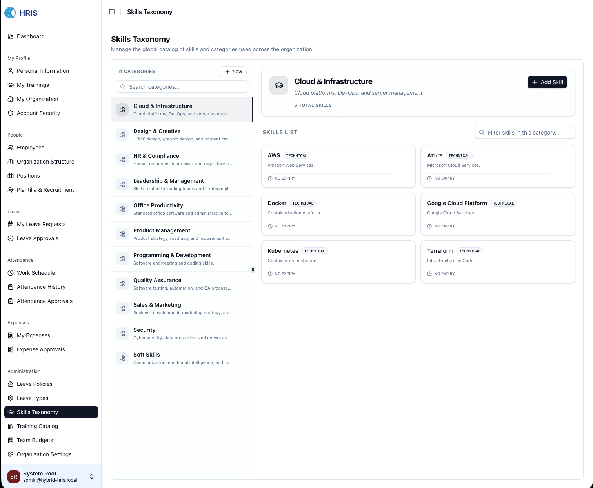

# Hybrid HRIS

## Project Overview

Hybrid HRIS is a modular, enterprise-oriented Human Resource Information System designed for hybrid deployment:

- **Standalone runtime** (PM2 / containerized Node)
- **Serverless runtime** (AWS Lambda + EventBridge)

The system focuses on deterministic background processing, clean domain separation, and database-level integrity enforcement.

### 🌐 Live Demo

**Url:** [https://hybrid-hris-web.vercel.app](https://hybrid-hris-web.vercel.app)  
**Email:** `admin@hybrid-hris.local`  
**Password:** `Admin123!`

### Core Modules

- **Employee Management** – Master records with PH-standard validation (Mobile/Landline), employment type, status, and movement tracking.
- **Organizational Structure** – Hierarchical Org Units, shared Positions, and recursive leadership authority models.
- **Manpower Request Workflow** – Formalized hiring requests with multi-level approval (HR Admin → Root Leader).
- **Plantilla & Headcount Inventory** – Real-time tracking of authorized vs. filled vs. vacant slots across the entire organization.
- **Leave Management (Ledger-Based)** – Robust leave tracking using an append-only financial-style ledger with deterministic monthly accruals.
- **Expense & Team Budgets** – Hierarchical budget allocation per Org Unit and category with real-time balance validation.
- **Attendance & Shift Management** – Shift templates, employee assignments, and localized timezone-aware attendance logging.
- **Skills & Training Management** – End-to-end professional development with automated skill granting, compliance tracking, and team readiness analytics.
- **Identity & RBAC** – Hardened database-first authorization with support for Supervisor/Manager hierarchical overrides.

### Design Philosophy

- **Immutable Ledgers:** Both Leave and Budget balances are derived from append-only ledgers, ensuring a perfect audit trail.
- **Hierarchical Recursive Authority:** Leaders automatically inherit authority over their entire downline (sub-units), powered by PostgreSQL Recursive CTEs for high-performance discovery.
- **Exception-Based Dashboards:** Management views focus on "Exceptions" (Missing Skills, Non-Compliance) rather than walls of data, enabling faster decision-making.
- **Real-time Plantilla Integrity:** Authorized headcount limits are strictly enforced; expansion is only possible through approved "New Headcount" workflows.
- **Monorepo Architecture:** Clean package boundaries using pnpm workspaces.

### Screenshots






---

## Tech Stack

- **Frontend:** Next.js 15 (App Router) – `apps/web`
- **API:** NestJS 11 – `apps/api`
- **Database:** PostgreSQL (Drizzle ORM) – `packages/db`
- **Rich Text:** Tiptap (WYSIWYG) for job postings
- **Domain Layer:** `packages/domain` (Shared business logic & enums)
- **Data Mocking:** Faker.js for enterprise-grade seeding

---

## Development Setup

### 1. Install Dependencies

```bash
pnpm install
```

### 2. Environment Configuration

Copy `.env.sample` to `.env` in the root and in `apps/api`.

### 3. Build Shared Packages

```bash
pnpm --filter "@hybrid-hris/*" run build
```

### 4. Database Setup

Ensure Docker is running, then run migrations and seed the **Enterprise Environment**:

```bash
pnpm --filter @hybrid-hris/db run db:migrate
LOAD_TEST_DATA=true pnpm --filter @hybrid-hris/db run seed
```
*The seed generates ~90 realistic employees, a 3-level org tree, 30 days of attendance, and full professional development history.*

### 5. Start Applications

**API:** `pnpm --filter api start:dev` (http://localhost:4000)  
**Web:** `pnpm --filter web dev` (http://localhost:3000)

---

## Management Features

### Recruitment & Plantilla
- **Operational Vacancy Detection:** Managers can see "Available" slots in their Org Unit and trigger hiring requests directly from the Org Structure view.
- **Approval Workflow:** Strict **HR Admin → Root Leader** chain for all recruitment needs.
- **Automated Headcount Expansion:** Final approval of a "New Headcount" request automatically increments the authorized Plantilla limit for that unit.

### Skills & Professional Development
- **Team Readiness Dashboard:** Visual "Role Fit" analysis for managers. Replaces complex heatmaps with actionable cards highlighting **Critical Gaps** (missing required skills) and **Growth Needs** (below target proficiency).
- **3-Layer Mandatory Training:** Define requirements at the **Global** (Company-wide), **Position** (Job Role), and **Org Unit** (Department) levels.
- **Automated Skill Pipeline:** Completing an internal training program automatically updates employee profiles with verified skills and proficiency levels.
- **Manager Direct Assignment:** Supervisors can directly assign and verify skills for their team, bypassing approval workflows for authoritative development.
- **Hierarchical Oversight:** Heads of Divisions can "Zoom Out" to see compliance and skill health for their entire downline (hundreds of employees) with server-side pagination and search.

### Leave & Accrual
- **Policy Engine:** Define different leave policies (e.g., Standard, Intern) with specific monthly accrual rates and carry-over limits.
- **Ledger Integrity:** Every credit and debit is a recorded transaction, making balance disputes impossible to occur without a clear audit trail.

### Expense & Budget Matrix
- **Budget Matrix:** Global view of allocations across all Organizational Units and Categories.
- **Real-time Consumption:** Expense filing includes immediate balance validation against the team's allocated budget.

---

## Next Steps

- [ ] Add Receipt File Upload support (S3/Local strategy).
- [ ] Implement Skill Expiry & Recertification proactive alerts.
- [ ] Add hybrid background job execution (BullMQ + Lambda/EventBridge).
- [ ] Integrate external Job Boards API (LinkedIn/Indeed/Jobstreet).

---

## License

This project is licensed under the MIT License - see the [LICENSE](LICENSE) file for details.
