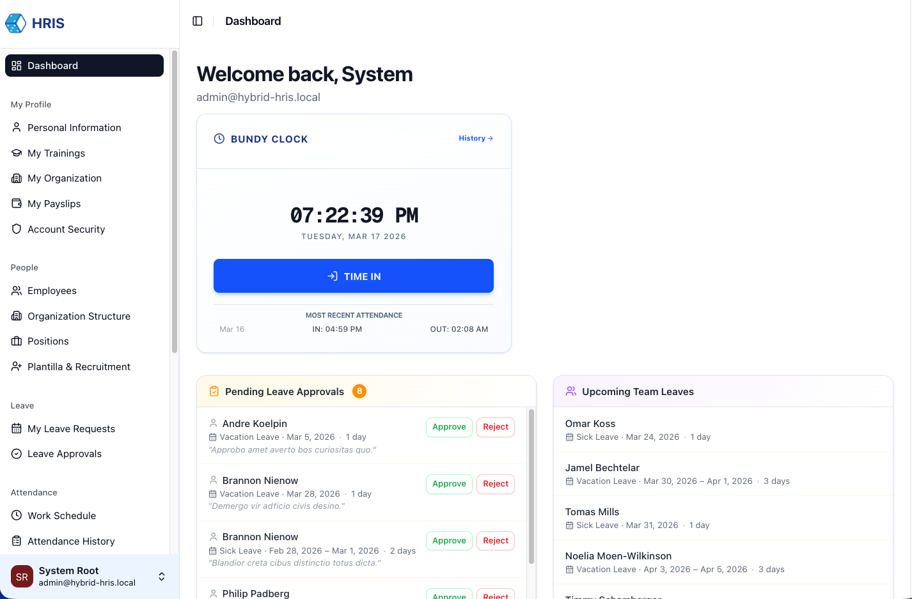
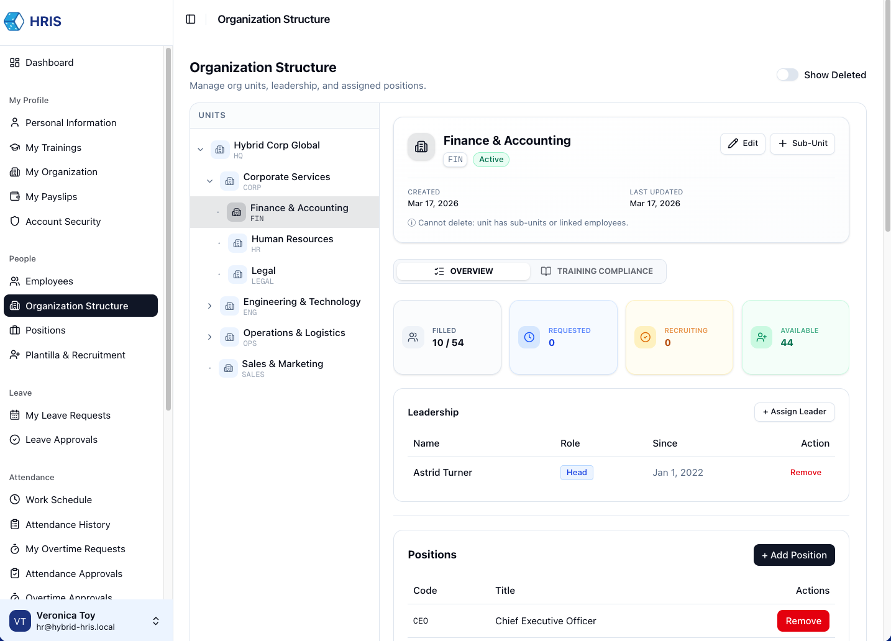
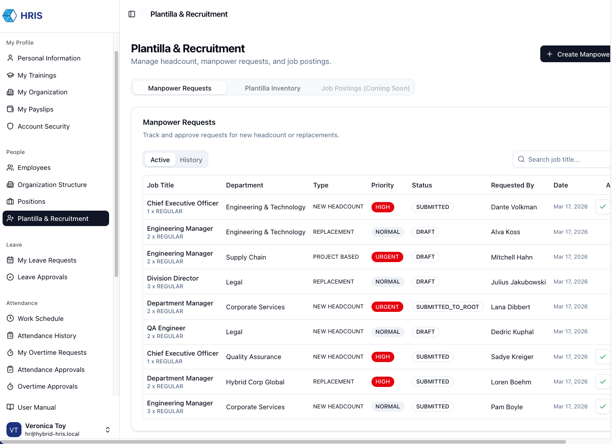
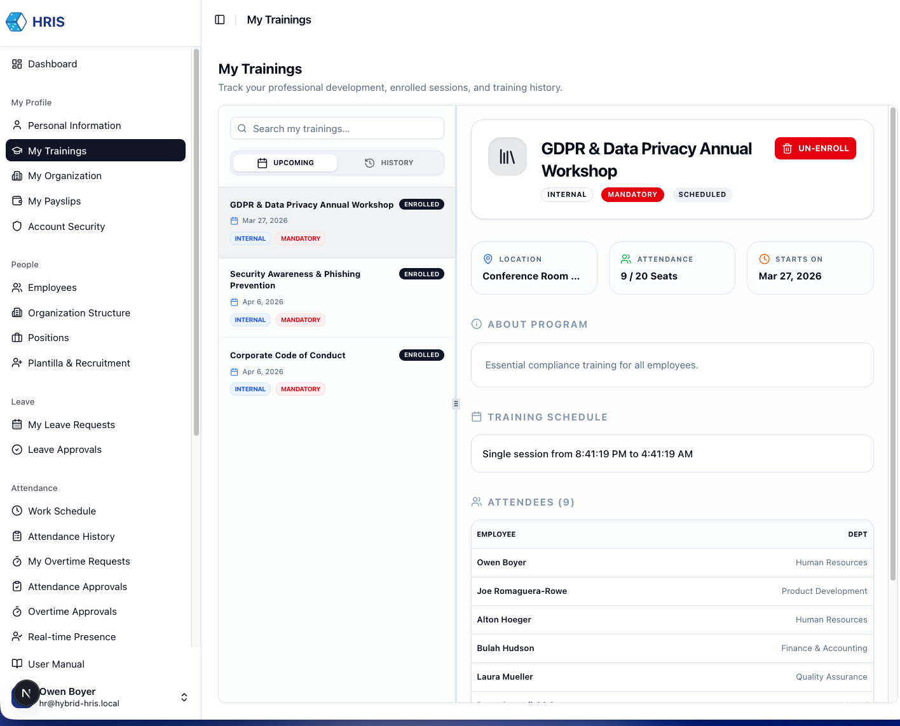
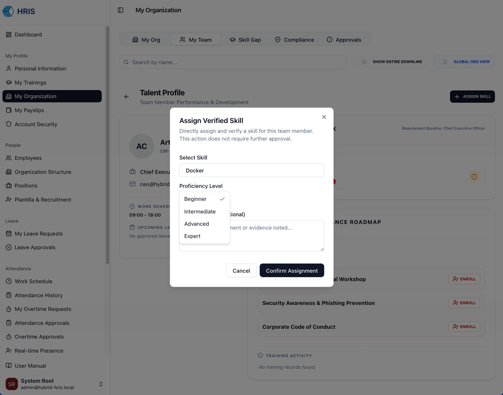
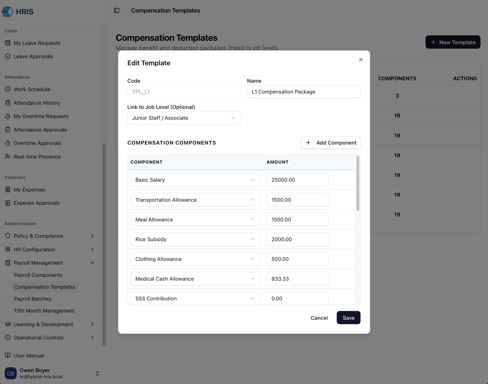
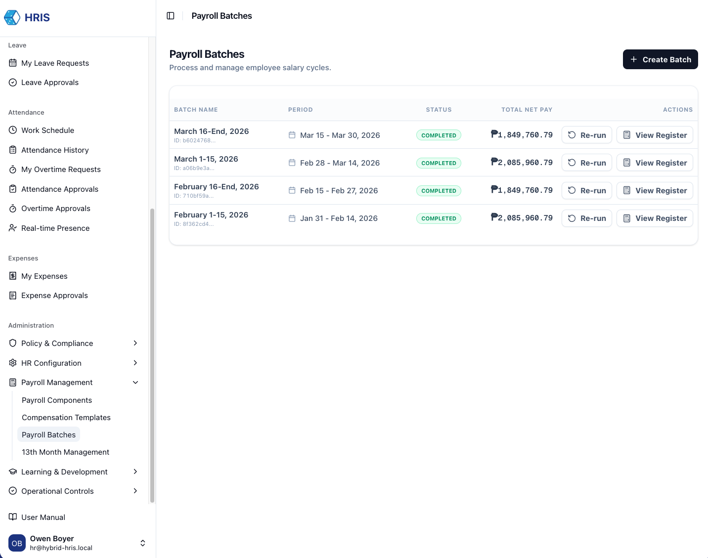
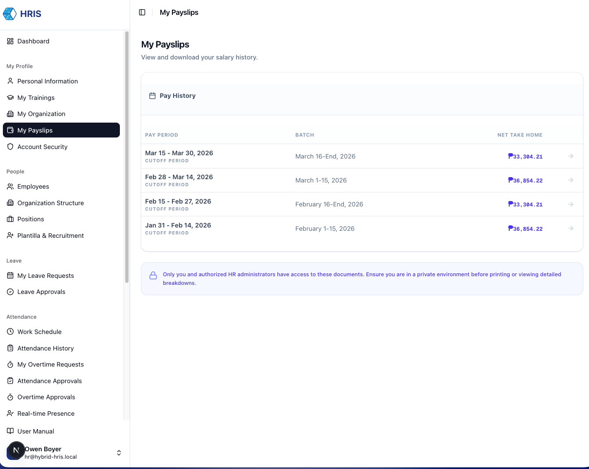

# Hybrid HRIS

A high-performance, modular Human Resource Information System.

## Important: Philippine Localization

This system is specifically architected to comply with **Philippine labor laws and taxation regulations**. While many modules (like Org Management, Skills, and Training) are universally applicable, the **Payroll, Benefits, and Accounting** modules are tailored for DOLE, BIR, and statutory requirements (SSS, PhilHealth, Pag-IBIG) of the Philippines.

Adapting the payroll engine for other countries would require significant modifications.

### Live Demo & Access

-   **URL:** [https://hybrid-hris-web.vercel.app](https://hybrid-hris-web.vercel.app)
-   **Password for all users:** `Admin123!`

| Role | Email | Scope |
| :--- | :--- | :--- |
| **System Admin** | `admin@hybrid-hris.local` | Full system access, including IT settings. |
| **HR Admin** | `hr@hybrid-hris.local` | Full access to all HR modules and employee data. |
| **Division Head** | `eng@hybrid-hris.local` | Manages the Engineering & Technology division. |
| **Department Manager** | `plat-mgr@hybrid-hris.local` | Manages the Platform Engineering department. |
| **Standard Employee** | `employee@hybrid-hris.local` | Self-service access. |

## User Manual
-   **URL:** [https://hybrid-hris-web.vercel.app/manual](https://hybrid-hris-web.vercel.app/manual)

## Screenshots
###  Dashboard


###  Organization Settings


###  Plantilla & Recruitment


### Skill Management & Learning Management System



### Payroll




## System Architecture

The project uses a PNPM Workspaces monorepo for strict type safety and code reuse between a NestJS API and a Next.js (Turbopack) web application.

-   **`apps/api`:** Hardened RESTful API with RBAC, Passport authentication, and Drizzle ORM.
-   **`apps/web`:** Responsive dashboard built with the Next.js App Router, Shadcn UI, and Tailwind CSS.
-   **`packages/db`:** Single source of truth for the PostgreSQL schema, managed with Drizzle ORM migrations.
-   **`packages/domain`:** Shared TypeScript interfaces, enums, and constants.

## Core Modules

### Philippine Payroll & Compensation
A rules-based engine designed for compliance with DOLE, BIR, and statutory regulations.

-   **Payroll Components Dictionary:** A dynamic dictionary for all earnings and deductions. Each component has configurable attributes like `isTaxable`, `isDeMinimis`, and `taxExemptLimit`, allowing HR to manage payroll items without code changes.
-   **Job Levels (Ranks):** A hierarchical ranking system to manage benefit tiers. Compensation and benefits can be tied to a rank instead of an individual, simplifying management.
-   **Employee Compensation Packages:** Assign recurring earnings (e.g., Basic Salary, Allowances) and deductions to employees with specific effective dates.
-   **Statutory Contribution Tables:** Government tables for SSS, PhilHealth, and Pag-IBIG are managed in the database using a Slowly Changing Dimensions (SCD Type 2) pattern, ensuring historical accuracy when rates change.
-   **Premium Pay & Overtime:** A dynamic matrix for defining custom multipliers for overtime, night differential, and holiday pay, ensuring compliance and flexibility.
-   **Payroll Run & Ledger:** A robust payroll generation process that creates immutable, auditable payslip records.

### Organizational Intelligence
-   **Hierarchical Org Tree:** Managed via Org Units with recursive leadership models for automatic authority inheritance.
-   **Plantilla & Headcount Management:** Real-time tracking of authorized positions vs. filled slots.

### Schedule & Attendance
-   **Advanced Schedule Management:** Create global shift templates with configurable grace periods.
-   **Future-Dated Schedule Changes:** Queue upcoming shift changes that are automatically applied on their effective date via a daily cron job.
-   **Real-time Presence Dashboard:** A "Who's In?" view for managers showing on-time, late, and absent employees based on their assigned schedule.

### Skills & Training
-   **3-Layer Mandatory Training:** Define compliance requirements at Global, Position, and Org Unit levels.
-   **Automated Skill Granting:** Link training programs to skills that are automatically awarded to an employee's profile upon completion.

### Leave & Expenses
-   **Ledger-Based Accruals:** Financial-style transaction logging for all leave credits and debits.
-   **Leave Policy Restrictions:** Restrict specific leave types (e.g., Vacation/Sick Leave) to certain employment statuses (e.g., Regular only), preventing accrual for non-eligible employees.
-   **Hierarchical Approvals:** Multi-level approval workflows for overtime, leave, and expenses.

## Tech Stack

-   **Frontend:** Next.js 16 (with Turbopack), TypeScript, Tailwind CSS, Shadcn UI
-   **Backend:** NestJS 11, Node.js 22, Drizzle ORM
-   **Database:** PostgreSQL
-   **DevOps:** Docker, PNPM Workspaces

## Getting Started

### 1. Installation
```bash
pnpm install
```

### 2. Environment Setup
Copy `.env.sample` to `.env` in the root directory. 

> [!NOTE]
> The root `.env` is used by all packages in the workspace. The API backend (`apps/api`) and Web frontend (`apps/web`) both rely on these variables for database connectivity and API URLs.

**Key Environment Variables:**
- `DATABASE_URL`: Connection string for PostgreSQL.
- `NEXT_PUBLIC_API_URL`: The URL of the API server (required for the web application).

### 3. Database Initialization
This command sets up the database, runs migrations, and populates it with a complete set of sample data, including the hierarchical organization structure.
```bash
pnpm --filter @hybrid-hris/db run db:reset
```

### 4. Running the Apps
To run both the **API** and **Web** applications simultaneously in development mode:
```bash
pnpm run dev
```

Alternatively, you can run them individually:
```bash
# API only
pnpm --filter api start:dev

# Web only
pnpm --filter web dev
```

## Deployment

### EC2 Deployment (using PM2)

1. **Build the Project**
   Ensure all packages and apps are built for production:
   ```bash
   pnpm run build
   ```

2. **Configure PM2**
   A root `ecosystem.config.js` is provided to manage both processes. It uses relative paths, so it should work out-of-the-box when run from the project root.

3. **Start the Applications**
   ```bash
   pm2 start ecosystem.config.js
   ```

4. **Monitor Processes**
   ```bash
   pm2 list
   pm2 logs
   ```

## License

This project is licensed under the MIT License.
